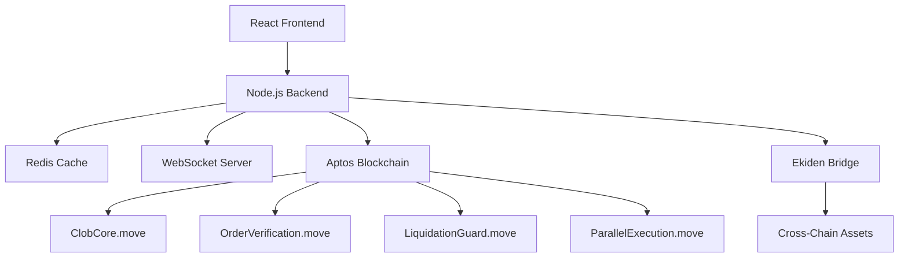

# CLOB-Trading-Platform
A comprehensive Central Limit Order Book (CLOB) trading platform built on Aptos that aggregates liquidity from multiple sources including native Aptos DEXs and cross-chain assets.
>>>>>>> 8c2f653beb19633b1e8346e5d1496504800eb130
# 🚀 CLOB Trading Platform

[](https://opensource.org/licenses/MIT)
[](https://aptos.dev)
[](https://move-language.github.io/move/)
[](https://reactjs.org/)
[](https://nodejs.org/)

A comprehensive **Central Limit Order Book (CLOB) trading platform** built on the Aptos blockchain that aggregates liquidity from multiple sources including native Aptos DEXs and cross-chain assets. This platform solves liquidity fragmentation across Aptos DEXs while providing a unified, secure, and high-performance trading experience.

## 🌟 Key Features

### 🔄 Multi-Source Liquidity Aggregation
- Aggregates liquidity from **Merkle Trade**, **Hyperion**, **Tapp Exchange**
- Unified order book for improved trading efficiency
- Eliminates liquidity fragmentation across Aptos DEXs

### 🌉 Cross-Chain Asset Support
- Integrates with **Ekiden Bridge SDK v0.8.2**
- Supports assets from Ethereum, Solana, BSC, and other major chains
- Seamless cross-chain deposits and withdrawals

### 📊 Real-Time Trading Interface
- Professional orderbook visualization with depth charts
- Live market data via WebSocket connections
- Advanced trading analytics and backtesting tools
- TradingView-style charting interface

### 🔐 Security & Verification
- **Formal verification** with Move Prover
- Order signature validation with replay protection
- Liquidation protection mechanisms
- Multi-signature admin controls

### ⚡ Performance Optimizations
- Optimized for Aptos' **parallel execution engine**
- Redis caching for high-frequency data
- Batch processing for multiple orders
- Low-latency WebSocket real-time feeds

## 🏗️ Architecture Overview



### Core Components

#### 📱 Frontend (React)
- **Trading Dashboard** - Professional trading interface
- **Order Book** - Real-time depth visualization
- **Trading Charts** - Advanced charting with analytics
- **Wallet Integration** - Petra/Martian wallet support
- **Cross-Chain Manager** - Multi-chain asset management

#### 🔧 Backend Services (Node.js)
- **API Server** - RESTful API with rate limiting
- **WebSocket Server** - Real-time market data feeds
- **Redis Service** - High-performance caching layer
- **Bridge Integration** - Cross-chain asset management

#### ⛓️ Smart Contracts (Move)
- **`ClobCore.move`** - Central order matching engine
- **`OrderVerification.move`** - Signature validation and replay protection
- **`LiquidationGuard.move`** - Position safety and liquidation protection
- **`ParallelExecution.move`** - Batch processing optimization

## 🛠️ Technology Stack

### Blockchain Layer
- **Aptos Blockchain** - L1 blockchain with parallel execution
- **Move Language** - Smart contract development
- **Move Prover** - Formal verification
- **Aptos TypeScript SDK v1.10.0** - Blockchain interaction

### Frontend
- **React 18.2.0** - Modern UI framework
- **Aptos UI Kit v2** - Aptos-specific components
- **Ant Design** - Professional UI components
- **Recharts** - Advanced charting library
- **Cypress** - End-to-end testing

### Backend
- **Node.js ≥16.0.0** - Runtime environment
- **Express.js** - Web application framework
- **Redis 7.2** - In-memory caching
- **WebSocket** - Real-time communication
- **Docker & Docker Compose** - Containerization

### Development Tools
- **ESLint** - Code linting
- **Jest** - Unit testing
- **Nodemon** - Development server
- **Vercel** - Frontend deployment

## 🚀 Quick Start Guide

### Prerequisites

Before starting, ensure you have the following installed:

```bash
# Check Node.js version (≥16.0.0 required)
node --version
npm --version

# Check Docker installation
docker --version
docker-compose --version

# Check Git
git --version
```

### Step 1: Install Aptos CLI

```bash
# Install Aptos CLI
curl -fsSL https://aptos.dev/scripts/install_cli.sh | sh

# Verify installation
aptos --version

# Initialize for testnet (creates ~/.aptos/config.yaml)
aptos init --network testnet

# Fund your account from faucet
aptos account fund-with-faucet --account <YOUR_ADDRESS>
```

### Step 2: Clone and Setup Project

```bash
# Navigate to project directory
cd "c:\Users\Administrator\Downloads\CLOB Trade Platform\CLOB-Trading-Platform"

# Install frontend dependencies
cd frontend
npm install

# Install backend dependencies
cd ../backend
npm install
```

### Step 3: Deploy Smart Contracts

```bash
# Navigate to move contracts
cd ../move-contracts

# Compile contracts
aptos move compile --named-addresses aptos_clob=<YOUR_ADDRESS>

# Run tests
aptos move test --named-addresses aptos_clob=<YOUR_ADDRESS>

# Deploy to testnet using automated script
./scripts/deploy.sh

# Or deploy manually
aptos move publish --named-addresses aptos_clob=<YOUR_ADDRESS> --assume-yes
```

### Step 4: Start Backend Services

```bash
# Navigate to backend
cd ../backend

# Start with Docker (recommended)
docker-compose up -d

# Check services are running
docker-compose ps

# View logs
docker-compose logs -f

# Alternative: Start without Docker
# npm run dev
```

### Step 5: Configure and Start Frontend

```bash
# Navigate to frontend
cd ../frontend

# Create environment configuration
echo "REACT_APP_CONTRACT_ADDRESS=<YOUR_DEPLOYED_CONTRACT_ADDRESS>" > .env
echo "REACT_APP_APTOS_NETWORK=testnet" >> .env
echo "REACT_APP_API_URL=http://localhost:3001" >> .env
echo "REACT_APP_NODE_URL=https://fullnode.testnet.aptoslabs.com/v1" >> .env

# Start development server
npm start
```

### Step 6: Access the Application

1. **Open your browser** to `http://localhost:3000`
2. **Install wallet extension** (Petra or Martian)
3. **Connect wallet** and switch to Aptos Testnet
4. **Start trading** with the professional interface!

## 📁 Project Structure

```
CLOB-Trading-Platform/
├── 📁 move-contracts/          # Smart contracts
│   ├── 📁 sources/
│   │   ├── 📄 ClobCore.move           # Order matching engine
│   │   ├── 📄 OrderVerification.move  # Signature validation
│   │   ├── 📄 LiquidationGuard.move   # Safety mechanisms
│   │   └── 📄 ParallelExecution.move  # Batch optimization
│   ├── 📁 scripts/
│   │   └── 📄 deploy.sh              # Deployment automation
│   └── 📄 Move.toml                  # Package configuration
├── 📁 frontend/                # React application
│   ├── 📁 src/
│   │   ├── 📁 components/
│   │   │   ├── 📄 TradingDashboard.js     # Main interface
│   │   │   ├── 📄 OrderBook.js           # Orderbook display
│   │   │   ├── 📄 TradingChart.js        # Charts & analytics
│   │   │   ├── 📄 WalletConnection.js    # Wallet integration
│   │   │   └── 📄 CrossChainAssetManager.js # Cross-chain
│   │   └── 📁 services/
│   │       ├── 📄 AptosService.js        # Blockchain API
│   │       ├── 📄 WebSocketService.js    # Real-time data
│   │       └── 📄 CrossChainBridgeService.js # Bridge SDK
│   ├── 📁 cypress/            # E2E tests
│   └── 📄 package.json        # Dependencies
├── 📁 backend/                 # Node.js services
│   ├── 📁 src/
│   │   ├── 📄 server.js              # Main API server
│   │   └── 📁 services/
│   │       └── 📄 RedisService.js     # Caching layer
│   ├── 📄 docker-compose.yml     # Service orchestration
│   ├── 📄 redis.conf             # Redis configuration
│   └── 📄 package.json           # Dependencies
├── 📁 config/                  # Configuration
│   └── 📄 aptos-config.json      # Aptos settings
├── 📁 scripts/                 # Utility scripts
└── 📄 README.md               # This file
```

## 🔧 Development Workflow

### Running Tests

```bash
# Smart contract tests
cd move-contracts
aptos move test --named-addresses aptos_clob=<YOUR_ADDRESS>

# Frontend unit tests
cd frontend
npm test

# End-to-end tests
npm run cypress:run

# Backend tests
cd backend
npm test
```

### Building for Production

```bash
# Build frontend
cd frontend
npm run build
# Or use production script
./scripts/build-production.sh

# Build backend Docker images
cd backend
docker-compose build

# Compile optimized contracts
cd move-contracts
aptos move compile --named-addresses aptos_clob=<YOUR_ADDRESS>
```

### Code Quality & Linting

```bash
# Frontend linting
cd frontend
npm run lint

# Backend linting
cd backend
npm run lint
npm run lint:fix
```

## 🌐 Deployment Options

### Testnet Deployment (Development)
- **Network**: Aptos Testnet
- **Contract Address**: `0x0cb059f1b02c44a9f485f6a529106c0ace6635da6c148dd1f66ee40502e4bb6e`
- **Explorer**: [View on Aptos Explorer](https://explorer.aptoslabs.com/account/0x0cb059f1b02c44a9f485f6a529106c0ace6635da6c148dd1f66ee40502e4bb6e?network=testnet)
- **Faucet**: [Get testnet APT](https://aptos.dev/network/faucet)

### Production Deployment

#### Frontend (Vercel)
```bash
cd frontend
vercel --prod
```

#### Backend (Docker)
```bash
cd backend
docker-compose -f docker-compose.prod.yml up -d
```

#### Smart Contracts (Mainnet)
```bash
cd move-contracts
aptos move publish --network mainnet --named-addresses aptos_clob=<MAINNET_ADDRESS>
```

## 🔍 API Documentation

### REST API Endpoints

| Method | Endpoint | Description |
|--------|----------|-------------|
| `GET` | `/api/orderbook` | Get current orderbook state |
| `GET` | `/api/trades` | Get recent trades |
| `POST` | `/api/orders` | Submit new order |
| `GET` | `/api/analytics` | Get trading analytics |
| `GET` | `/api/health` | Health check |

### WebSocket Events

| Event | Description |
|-------|-------------|
| `orderbook_update` | Real-time orderbook changes |
| `trade_executed` | New trade notifications |
| `price_update` | Price feed updates |
| `market_data` | Market statistics |

## 🛠️ Troubleshooting

### Common Issues

#### Contract Deployment Fails
```bash
# Check account balance
aptos account list --query balance --account <YOUR_ADDRESS>

# Fund account if needed
aptos account fund-with-faucet --account <YOUR_ADDRESS>

# Verify CLI configuration
aptos config show-profiles
```

#### Frontend Won't Connect to Backend
```bash
# Check backend is running
curl http://localhost:3001/health

# Verify environment variables
cat frontend/.env

# Check Docker services
docker-compose ps
docker-compose logs backend
```

#### Wallet Connection Issues
1. Ensure Petra or Martian wallet is installed
2. Switch wallet to Aptos Testnet
3. Clear browser cache and cookies
4. Check wallet extension permissions

#### Redis Connection Errors
```bash
# Check Redis is running
docker-compose ps redis

# Test Redis connection
redis-cli ping

# Restart Redis service
docker-compose restart redis
```

### Performance Issues

#### Slow Orderbook Updates
- Check WebSocket connection stability
- Verify Redis cache performance
- Monitor network latency

#### High Gas Costs
- Use batch operations when possible
- Optimize transaction timing
- Consider gas price fluctuations

### Debug Mode

```bash
# Enable debug logging
export DEBUG=clob:*

# Frontend debug mode
export REACT_APP_DEBUG=true

# Backend verbose logging
export LOG_LEVEL=debug
```

## 📊 Performance Metrics

### Target Performance
- **First Contentful Paint**: < 1.5s
- **API Response Time**: < 100ms (95th percentile)
- **WebSocket Latency**: < 50ms
- **Order Processing**: < 2s confirmation
- **Cache Hit Rate**: > 95%

### Monitoring
- Real-time performance metrics
- Error tracking and alerting
- User analytics and heatmaps
- System health monitoring

## 🎯 Hackathon Targets

### Awards
- **🏆 Main Track**: Trading & Market Infrastructure ($65k)
- **🏆 Best Tech Implementation**: Advanced Move usage ($15k)

### Value Proposition
- **Problem Solved**: Eliminates Aptos liquidity fragmentation
- **Technical Innovation**: Move-based security + cross-chain aggregation
- **User Impact**: Unified trading experience for retail and institutions
- **Aptos Integration**: Deep utilization of parallel execution and low fees

## 🤝 Contributing

### Development Setup
1. Fork the repository
2. Create a feature branch: `git checkout -b feature/amazing-feature`
3. Commit changes: `git commit -m 'Add amazing feature'`
4. Push to branch: `git push origin feature/amazing-feature`
5. Open a Pull Request

### Code Standards
- Follow ESLint configuration
- Write comprehensive tests
- Document API changes
- Use conventional commit messages

## 📄 License

This project is licensed under the MIT License - see the [LICENSE](LICENSE) file for details.

## 🔗 Links

- **[Aptos Documentation](https://aptos.dev)**
- **[Move Language Guide](https://move-language.github.io/move/)**
- **[Aptos Explorer](https://explorer.aptoslabs.com)**
- **[Petra Wallet](https://petra.app)**
- **[Martian Wallet](https://martianwallet.xyz)**

## 📞 Support

For questions and support:
- 📧 Email: support@clobtrading.com
- 💬 Discord: [Join our community]
- 🐛 Issues: [GitHub Issues](https://github.com/your-org/clob-trading-platform/issues)
- 📖 Documentation: [Full Documentation](./docs/)

---

<div align="center">

**🎉 Built with ❤️ for the Aptos Ecosystem 🚀**

*Bringing institutional-grade trading to decentralized finance*

[⭐ Star this repo](https://github.com/your-org/clob-trading-platform) • [🍴 Fork](https://github.com/your-org/clob-trading-platform/fork) • [📝 Report Bug](https://github.com/your-org/clob-trading-platform/issues)

</div>
=======
# CLOB-Trading-Platform
A comprehensive Central Limit Order Book (CLOB) trading platform built on Aptos that aggregates liquidity from multiple sources including native Aptos DEXs and cross-chain assets.
>>>>>>> 8c2f653beb19633b1e8346e5d1496504800eb130
